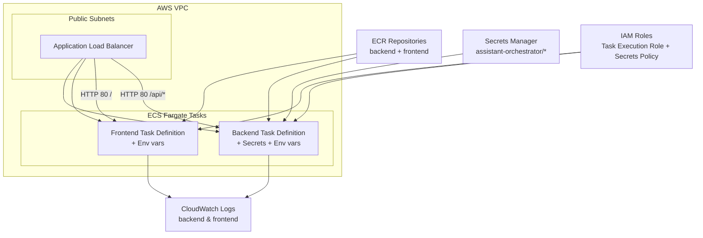

# 🏗️ Infrastructure Overview (Terraform, AWS, ECS Fargate)

Цей документ описує основні компоненти інфраструктури, створеної у файлі `main.tf`.

---
# ✔️ Summary

Інфраструктура складається з:

- ECS Fargate backend + frontend
- ALB з правилами маршрутизації
- ECR образів
- IAM ролей із доступом до Secrets Manager і Bedrock
- CloudWatch логів
- S3 backend для Terraform state
- Security Groups
- Підтримка SPA frontend + API backend через ALB rewrite

# Детально інфраструктура рішення
## 1. Terraform Backend

- **S3 Backend**: зберігає Terraform state  
  - Bucket: `hakaton-vikings-bucket`  
  - Key: `fargate/terraform.tfstate`  
  - Region: `eu-central-1`  
  - State зашифрований через SSE

---

## 2. AWS Provider

- Основний регіон для ресурсів: **us-east-1**
- ECR образи читаються з **eu-central-1**

---

## 3. ECR (Репозиторій для імеджів на AWS))

Terraform отримує URI контейнерів:

- Backend:  
  - repository: `var.ecr_repository_name`  
  - tag: `latest`
- Frontend:  
  - repository: `var.frontend_ecr_repository_name`  
  - tag: `latest`

---

## 4. ECS Cluster (Сервіс запуску контейнерів)

- EC2/Fargate Cluster:  
  `aws_ecs_cluster.main`

---

## 5. IAM Roles (Ролі і дозволи)

### ECS Task Execution Role
- Role: `${var.project_name}-task-execution-role`
- Дозволи:
  - `AmazonECSTaskExecutionRolePolicy`
  - Читання секретів:
    - `assistant-orchestrator/*`
  - KMS decrypt (умовно через Secrets Manager)
  - Доступ до `bedrock:*`

---

## 6. Security Groups (Мережевий firewall)

### ALB Security Group
- Дозволяє HTTP (80) з усього світу

### ECS Task Security Group
- Дозволяє трафік **лише від ALB**
- Egress — відкритий в інтернет

---

## 7. Application Load Balancer (Розподіл навантаження)

- **Public ALB**
- Прив'язаний до Public Subnets
- Security Group: `alb_sg`

### Target Groups:
- `backend-tg` → порт бекенду  
- `frontend-tg` → порт фронтенду

### Listener (HTTP:80)
- За замовчуванням → Frontend TG
- `/api/*` → Backend TG (правило + url rewrite)

---

## 8. CloudWatch Log Groups (Логування)

- `/ecs/${project}-backend` — retention 7 днів  
- `/ecs/${project}-frontend` — retention 7 днів

---

## 9. ECS Task Definitions (Визначення того що запускаємо на кластері)

### Backend Task Definition
- CPU: 256  
- RAM: 512  
- Network mode: awsvpc  
- Образ: latest з ECR
- Port mappings: `${var.backend_container_port}`
- Secrets:
  - LLM Proxy API Key
  - Langfuse Secret Key
  - Langfuse Public Key
- Environment:
  - `LLM_PROXY_SERVICE_API_URL`
  - `AWS_BEDROCK_GUARDRAIL_ID`
  - `AWS_BEDROCK_GUARDRAIL_VERSION`

### Frontend Task Definition
- CPU: 256  
- RAM: 512  
- API_URL: вшито:  
  `API_BASE_URL = "http://${aws_lb.main.dns_name}"`

---

## 10. ECS Services

### Backend Service
- Desired count: `var.desired_container_count`
- Fargate
- Public subnets
- SG: `ecs_task_sg`
- Load Balancer → backend target group

### Frontend Service
- Desired count: `var.desired_container_count`
- Public subnets
- SG: `ecs_task_sg`
- Load Balancer → frontend target group

---

## 11. Networking

### VPC (створюється окремо)
- Public Subnets  
- Використовується ALB та ECS Tasks

---

## 12. Secrets (Secrets Manager)

Terraform-роль має доступ до секретів:

- `assistant-orchestrator/llm_api_key`
- `assistant-orchestrator/langfuse_secret_key`
- `assistant-orchestrator/langfuse_public_key`

---

## 13. Bedrock Guardrails (Валідація input-output для моделі)

Задаються через environment variables:

- `AWS_BEDROCK_GUARDRAIL_ID = local.aws_bedrock_guardrail_id`
- `AWS_BEDROCK_GUARDRAIL_VERSION = DRAFT`

---

