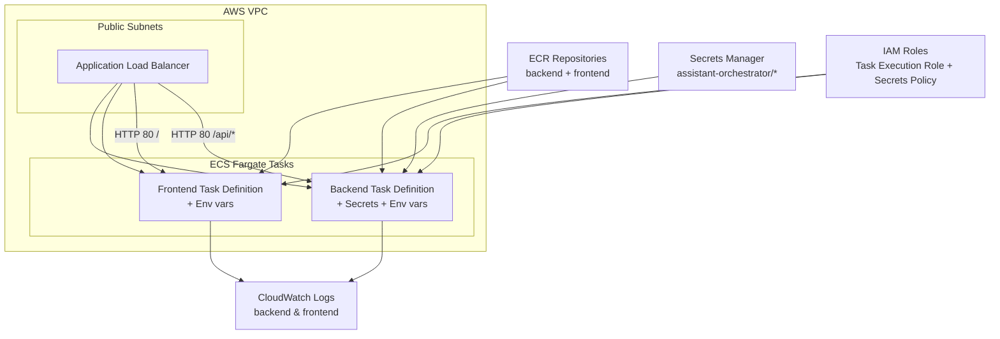

```mermaid
flowchart TD

    %% =============================
    %%  AWS Global Components
    %% =============================

    subgraph VPC["AWS VPC"]
        direction TB

        subgraph PublicSubnets["Public Subnets"]
            direction TB
            ALB["Application Load Balancer"]
        end

        subgraph ECS["ECS Fargate Tasks"]
            direction TB
            BackendTask["Backend Task Definition<br/>+ Secrets + Env vars"]
            FrontendTask["Frontend Task Definition<br/>+ Env vars"]
        end

        ALB -->|HTTP 80 /api/*| BackendTask
        ALB -->|HTTP 80 /| FrontendTask

    end

    %% =============================
    %% Supporting Infra
    %% =============================

    ECR["ECR Repositories<br/>backend + frontend"]
    SecretsManager["Secrets Manager<br/>assistant-orchestrator/*"]
    CWLogs["CloudWatch Logs<br/>backend & frontend"]
    IAM["IAM Roles<br/>Task Execution Role + Secrets Policy"]

    %% Flows

    ECR --> BackendTask
    ECR --> FrontendTask

    SecretsManager --> BackendTask

    BackendTask --> CWLogs
    FrontendTask --> CWLogs

    IAM --> BackendTask
    IAM --> FrontendTask

    ALB --> FrontendTask
    ALB --> BackendTask
```